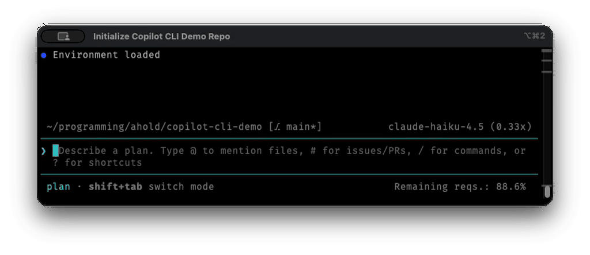

# gifframe

> Convert terminal screen recordings (`.mov`) into polished animated GIFs —
> complete with macOS-style window chrome: rounded corners, white background,
> and a soft drop shadow.

[](https://github.com/Addono/gifframe/actions/workflows/ci.yml)
[](https://github.com/Addono/gifframe/pkgs/container/gifframe)
[](LICENSE)

---

<p align="center">
  
</p>

---

## Features

- 🎨 **macOS-style chrome** — anti-aliased rounded corners (r = 12 px) and a
  soft Gaussian drop shadow (σ = 20 px, 70 % opacity) analytically matched to
  a real macOS screenshot
- 🖼️ **Clean white background** — BFS flood-fill removes the desktop backdrop
  without touching window content, even when both share the same colour
- 🎨 **Full colour output** — terminal syntax highlighting, prompt colours, and
  UI accents are preserved
- ⚡ **Fast** — shadow computed once per quality level; all frames processed in
  parallel with `ThreadPoolExecutor` + numpy-vectorised pixel operations
- 📦 **Three quality presets** tuned for terminal recordings
- 🐳 **Docker image** — zero local dependencies beyond Docker itself

---

## Quick start

### Pre-requisites

Record a video of a terminal using MacOS' built-in screen recording tool. Set it to "Record Selected Window" mode. 

The resulting screen-recording will have a border and black background. We will use this tool to remove that background, then re-apply a similar looking backdrop with a color of your choosing, e.g. white.

### Option 1 — Docker (recommended, no local setup)

```bash
# Convert all .mov files in the current directory
docker run --rm -v "$(pwd):/work" ghcr.io/addono/gifframe

# Convert a specific file at extra-high quality
docker run --rm -v "$(pwd):/work" ghcr.io/addono/gifframe -q xhigh demo.mov
```

Output GIFs are written to `./gifs/` on your host machine.

> **💡 Pro tip:** Create a shell alias to skip typing the full Docker command every time:
> ```bash
> alias gifframe='docker run --rm -v "$(pwd):/work" ghcr.io/addono/gifframe'
> ```
> Then use it just like the CLI version:
> ```bash
> ❯ gifframe *.mov                      # Convert all .mov files
> ❯ gifframe -q xhigh recording.mov    # High quality
> ```
> Add the alias to your shell config (`.zshrc`, `.bashrc`, etc.) to persist it across sessions.

### Option 2 — Run directly

```bash
# Clone and make the script executable
git clone https://github.com/Addono/gifframe.git
chmod +x gifframe/bin/gifframe

# Optional: add to PATH
export PATH="$PATH:$(pwd)/gifframe/bin"
```

**Dependencies** (install once):

| Tool | macOS | Ubuntu/Debian |
|------|-------|---------------|
| ffmpeg | `brew install ffmpeg` | `apt install ffmpeg` |
| ImageMagick | `brew install imagemagick` | `apt install imagemagick` |
| Python 3 + numpy | `brew install numpy` | `apt install python3 python3-numpy` |

```bash
# Convert all .mov files in the current directory
gifframe

# Convert a specific file
gifframe recording.mov

# Pick a quality preset
gifframe -q xhigh demo.mov
```

---

## Usage

```
gifframe [OPTIONS] [FILE...]

Arguments:
  FILE                   .mov file(s) to convert.
                         Defaults to all *.mov in the current directory.

Options:
  -q, --quality PRESET   Quality preset (default: high)
                           medium  – 15 fps, 640 px wide,  128 colors
                           high    – 12 fps, 1024 px wide, 128 colors  ← default
                           xhigh   – 20 fps, 1024 px wide, 256 colors
                           all     – render all three presets
  -b, --background COLOR Background color (default: white)
                           CSS name      white, black, "#1e1e2e"
                           R,G,B         30,30,46
                           R,G,B,A       0,0,0,128  (A < 128 → transparent)
                           transparent / none  → transparent GIF (no shadow)
  -h, --help             Show this help message
```

### Examples

```bash
# Convert every .mov in the current directory at the default (high) quality
gifframe

# Convert one file
gifframe session.mov

# High-fidelity render for a blog post
gifframe -q xhigh session.mov

# Smaller file for a GitHub README
gifframe -q medium session.mov

# Batch — all files, all presets
gifframe -q all *.mov

# Dark background matching VS Code / GitHub dark theme
gifframe -b "30,30,46" session.mov

# Exact hex colour
gifframe -b "#1e1e2e" session.mov

# Transparent background (no shadow; useful when embedding in dark UIs)
gifframe -b transparent session.mov
```

---

## Quality presets

| Preset | FPS | Width | Colours | Best for |
|--------|-----|-------|---------|----------|
| `medium` | 15 | 640 px | 128 | README badges, quick previews |
| `high` *(default)* | 12 | 1024 px | 128 | Blog posts, documentation |
| `xhigh` | 20 | 1024 px | 256 | High-fidelity demos, presentations |

All presets use a lossless Lanczos rescale and a two-pass FFmpeg palette
(`palettegen` → `paletteuse`) optimised for the limited palette of terminal UIs.

---

## How it works

```
┌─────────────────────────────────────────────────────┐
│  .mov  →  FFmpeg  →  raw PPM frames                 │
│                          │                          │
│             Python (numpy + BFS)                    │
│             ┌────────────┴──────────────┐           │
│             │  1. BFS flood-fill        │           │
│             │     background mask       │           │
│             │  2. Alpha mask            │           │
│             │     (rounded corners)     │           │
│             │  3. Shadow background     │           │
│             │     (computed once)       │           │
│             │  4. Per-frame composite   │           │
│             │     (parallel, no blur)   │           │
│             └────────────┬──────────────┘           │
│                          │                          │
│  PNG frames  →  FFmpeg  →  optimised GIF            │
└─────────────────────────────────────────────────────┘
```

1. **Frame extraction** — FFmpeg decodes the `.mov` and writes raw PPM frames
   (bypassing a redundant per-frame ImageMagick decode step).

2. **BFS flood-fill** — Python seeds from every edge pixel and propagates
   through pixels within a per-channel tolerance of 3/255. The macOS desktop
   background and terminal window background are both pure black — but the
   window title bar chrome (~`#1E2023`, Δ ≈ 30) stops the fill cleanly at the
   window boundary.

3. **Alpha mask** — Computed once with fully vectorised numpy operations,
   encoding anti-aliased rounded corners (r = 12 px, sub-pixel accuracy).

4. **Shadow background** — The expensive Gaussian blur is run **once** per
   quality level using the static window silhouette. Each frame then only needs
   a cheap `composite` call.

5. **GIF assembly** — FFmpeg reads the processed PNG frames and builds an
   optimised GIF using a two-pass custom colour palette.

**Key optimisations:**
- numpy `frombuffer` / array operations replace Python pixel loops (no GIL contention)
- `ThreadPoolExecutor` parallelises the per-frame `composite` calls across all CPU cores
- Shadow Gaussian blur runs once per file, not once per frame

---

## Docker

The Docker image is published to the GitHub Container Registry on every push to
`main` and for every semver tag.

```bash
# Pull latest
docker pull ghcr.io/addono/gifframe:latest

# Run (mounts current directory as /work inside the container)
docker run --rm -v "$(pwd):/work" ghcr.io/addono/gifframe [OPTIONS] [FILE...]
```

### Building locally

```bash
docker build -t gifframe .
docker run --rm -v "$(pwd):/work" gifframe -q high demo.mov
```

---

## Development

### Running the tests

The test suite requires `bats`, `ffmpeg`, `imagemagick`, and `python3-numpy`.

```bash
# macOS
brew install bats-core ffmpeg imagemagick numpy

# Ubuntu / Debian
sudo apt install bats ffmpeg imagemagick python3 python3-numpy

# Run all tests
bats tests/
```

### Project layout

```
gifframe/
├── bin/
│   └── gifframe         # Main conversion script (bash + python3 heredoc)
├── docs/
│   └── demo.gif         # Demo used in this README
├── tests/
│   └── test_gifframe.bats
├── .github/
│   └── workflows/
│       ├── ci.yml       # Lint + test + Docker build on every PR
│       └── cd.yml       # Build & push Docker image to GHCR on main / tag
├── Dockerfile
└── LICENSE
```

---

## License

[MIT](LICENSE) © 2024 [Adriaan Knapen](https://aknapen.nl)
